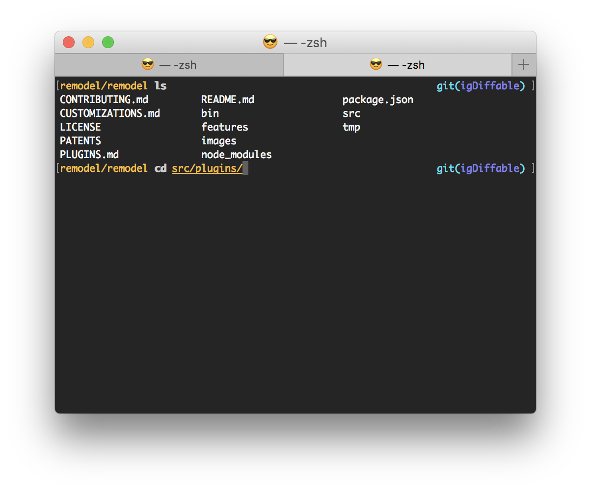

# .dotfiles

My .dotfiles to configure zsh/git/hg/lldb etc. to my needs



## Install guide

1. Clone it into `~`
2. Make sure you have the submodules by running `git submodule update --recursive --init`
3. Run `install.sh`
4. Add your git user info in `~/.dotfiles/secret/.gitconfig` like this:

```
[user]
  name  = Marty McFly
  email = mmcfly@hillvalley.edu
```